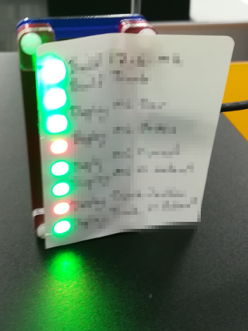

Jenkins Pi
==========

Use a Raspberry PI with the Blinkt module to monitor jobs in Jenkins CI.

Install
-------

Ansible installs on raspian-stretch (lite). Installs onto hosts in the monitors
group.

`ansible-playbook framework.yml` installs required modules and sets up a
windows share `\\monitor\apps` for the individual applications.

Applications
------------

`ansible-playbook install_apps.yml` installs the applications in the `detail` variable of the playbook.

* copy programs and configs to pi. programs are in `files\programs` folder
* creates a virtualenv for each program
* installs the program as a service running python on the `details/main` file

### jenkins_publish
Polls Jenkins and publishes `{building, result, build_id}` to mqtt topics. 

### blink_display
Displays the `result` and `building` status for topics on blink lights

### control
A quick and easy way to reboot the pi. Edit the config file and change the
`control/status` value to `reboot`

### board_config
A used to send a configuration to micropython boards.
